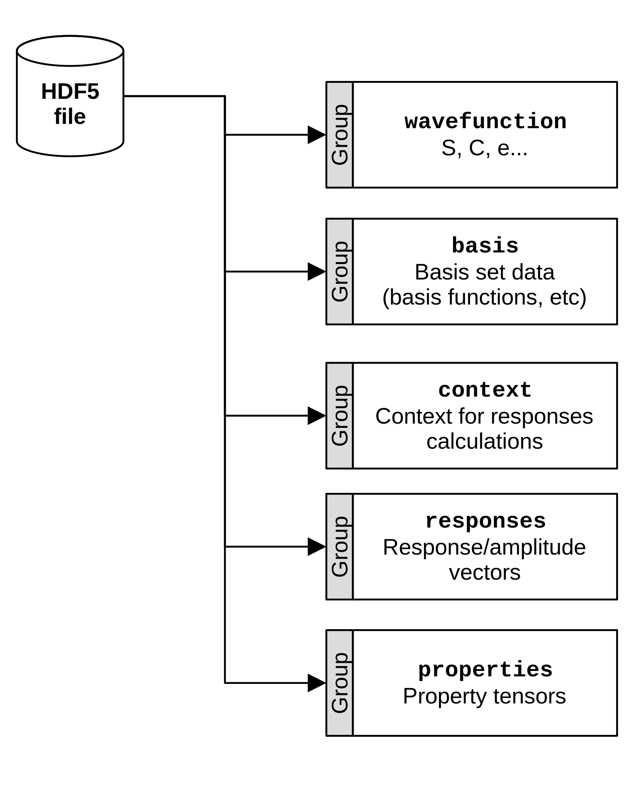
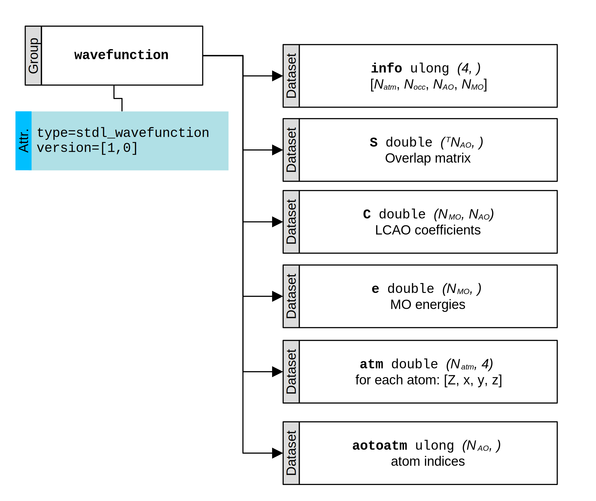
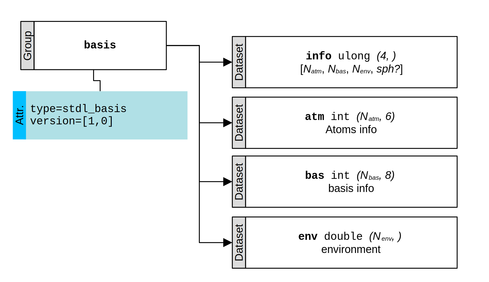
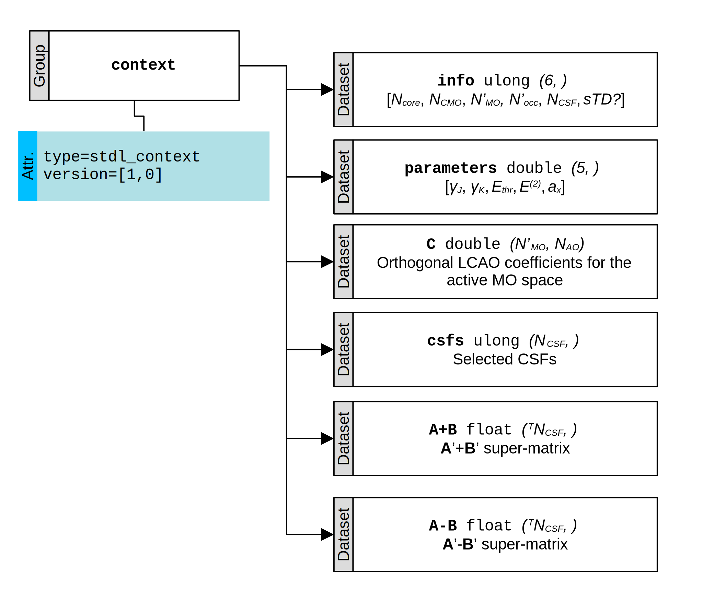
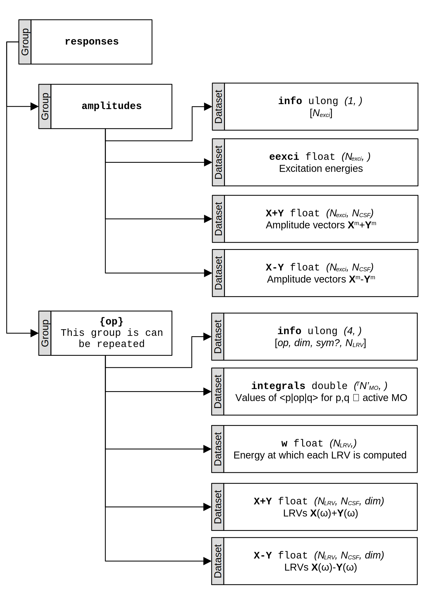
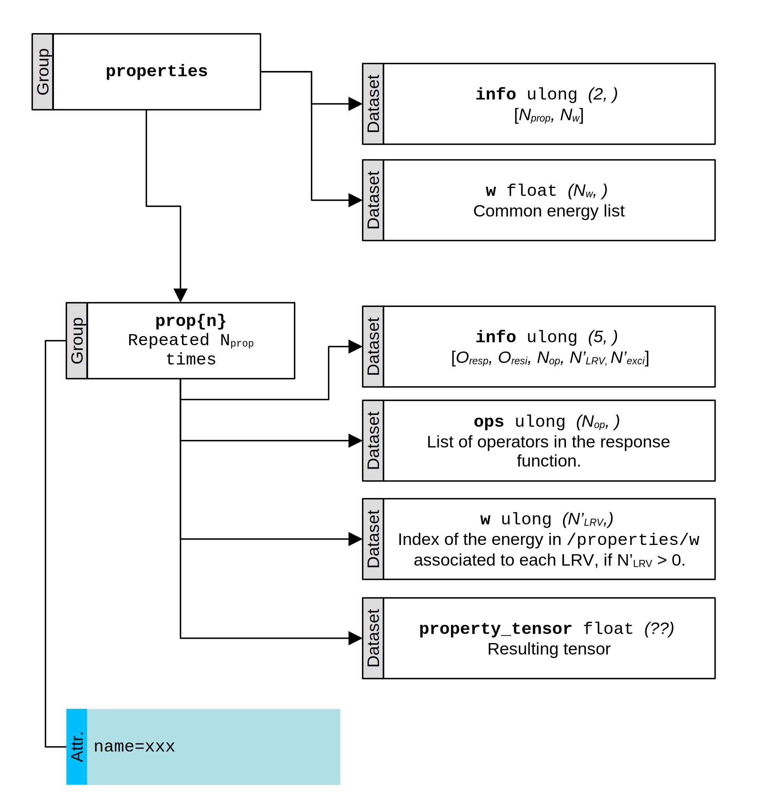

# `stdlite_run`

This page describe in details the usage of `stdlite_run`.

## Calling `stlite_run`

The utility `stdlite_run` primarily read an input file written in the [TOML format](https://toml.io/), described below.

A typical way to call the utility is to use:

```bash
stdlite_run input.toml
```

Command line options, described below can also be given:

```bash
stdlite_run input.toml --ctx_ax="0.7"
```

Note that a command line option, when it exists, have precedence over the input file.

## Environment variables

If the application is built to do so (which is the default), one can control the number of processors used by [OpenMP](https://openmp.llvm.org/) to accelerate the program:

```bash
export OMP_NUM_THREADS=4
```

Eventually, the verbosity level can be adjusted through environment variables:

```bash
export STDL_LOG_LEVEL=1 # default is 0, set to -1 to silence the program
export STDL_DEBUG_LEVEL=3 # default is 1, set to -1 to silence the program
```

## Inputs

In the following, "Keyword" refers to keywords that can be put in the TOML input.

When a keyword type is "`str`/`float` (energy)", the energy is to be given in the format `"xxxYY"`, where `xxx` is a number, and `YY` is a unit.
Currently, 3 units are supported: `au` ([atomic units](https://en.wikipedia.org/wiki/Atomic_units)), `eV` ([electronvolts](https://en.wikipedia.org/wiki/Electronvolt)), and `nm` (nanometers).
If no unit are given, atomic units are assumed.
Valid inputs are, *e.g.*, `"8.5eV"`, `"1200nm"`, `"0.25au"`, `1.25`, etc.

### General 

!!! abstract "Title"

    **Type**: `str`
    **Keyword**: `title`
    **Default**: None

    Title of the calculation, in free format.
    It is there for documentation/archiving purposes, and will never be parsed.

!!! abstract "Output"

    **Type**: `str` (path)
    **Keyword**: `data_output`
    **Command line option**: `--data_output`
    **Default**: `"stdlite_calculation.h5"`

    Path where the data of the calculation will be stored, in [HDF5](https://en.wikipedia.org/wiki/Hierarchical_Data_Format).

### Context (`[context]`)

These are the keywords related to the creation of the context, *i.e.*, the selection of the CSFs and the creation of the $\mathbf A'$ and $\mathbf B'$ super-matrices. 

!!! abstract "Source"

    **Type**: `str` (path)
    **Keyword**: `source`
    **Command line option**: `--ctx_source`

    Path to a QM file containing at least a wavefunction and a corresponding basis set. 
    This is the only **mandatory** keyword.

!!! abstract "Source type"

    **Type**: `str`
    **Keyword**: `source_type`
    **Command line option**: `--ctx_source_type`
    **Default**: `"FCHK"`

    Type of source. Currently the possible values are:

    + `"MOLDEN"` (Molden file), 
    + `"FCHK"` (Gaussian FCHK), 
    + `"STDL_CTX"` (context from a previous calculation), and 
    + `"STDL_CTX_WB"` (context from a previous calculation, but only the wavefunction and basis are used).

    Note that `"STDL_CTX"` implies that exactly the same context, *i.e.*, the same CSFs and the same $\mathbf A'$ and $\mathbf B'$ super-matrices are used, so it totally skips the context creation.
    If you want to re-create a new context, use `"STDL_CTX_WB"`.

!!! abstract "Energy threshold"

    **Type**: `str`/`float` (energy)
    **Keyword**: `ethr`
    **Command line option**: `--ctx_ethr`
    **Default**: `"7eV"`

    Energy threshold for the [truncation of the CI space](theory.md#truncation-of-the-active-space).

!!! abstract "Perturbation energy threshold"

    **Type**: `str`/`float` (energy)
    **Keyword**: `e2thr`
    **Command line option**: `--ctx_e2thr`
    **Default**: `"1e-4au"`

    Perturbation energy threshold for the selection of secondary CSFs in the [truncation of the CI space](theory.md#truncation-of-the-active-space).

!!! abstract "Method for the creation of context"

    **Type**: `str`
    **Keyword**: `method`
    **Command line option**: `--ctx_method`
    **Default**: `"monopole"`

    Method for the calculation of the elements of the  $\mathbf A'$ and $\mathbf B'$ super-matrices. 
    Currently the possible values are:

    + `"monopole"` ([default sTD-DFT procedure](theory.md#std-dft-or-the-monopole-approximation), *i.e.*, the monopole approximation).

!!! abstract "Tamm-Dancoff approximation"

    **Type**: `int`
    **Keyword**: `tda`
    **Command line option**: `--ctx_tda`
    **Default**: `1`

    If different from 0, use the [Tamm-Dancoff approximation](theory.md#application-to-dft-td-dft).

!!! abstract "Parameter for Coulomb ops_integrals"

    **Type**: `float`
    **Keyword**: `gammaJ`
    **Command line option**: `--ctx_gammaJ`
    **Default**: `4.0`

    Parameters for the Coulomb integral, $\gamma_J$, in the [monopole approximation](theory.md#std-dft-or-the-monopole-approximation).

!!! abstract "Parameter for exchange ops_integrals"

    **Type**: `float`
    **Keyword**: `gammaK`
    **Command line option**: `--ctx_gammaK`
    **Default**: `2.0`

    Parameters for the exchange integral, $\gamma_K$, in the [monopole approximation](theory.md#std-dft-or-the-monopole-approximation).

!!! abstract "Hartree-Fock exchange percentage"

    **Type**: `float`
    **Keyword**: `ax`
    **Command line option**: `--ctx_ax`
    **Default**: `0.5`

    Assuming a global hybrid, amount of Hartree-Fock exchange, between 0 and 1.

!!! abstract "Gauge origin"

    **Type**: `list`
    **Keyword**: `gauge_origin`
    **Default**: the center of mass of the molecule

    Set the gauge origin for the angular momentum (`angm`) operator.

### Responses (`[responses]`)

These are the keywords related to the calculation of responses, their residues, and the related properties.

In the following, `wX` is a frequency, thus following the syntax for energy mentioned in the preamble. `opX` is an operator, which should be one of:

+ `"dipl"`: dipole length operator;
+ `"dipv"`: dipole velocity operator;
+ `"angm"`: angular momentum operator.

Other operators will be added in the future.

!!! abstract "Linear reponses"

    **Type**: `list`
    **Keyword**: `linear`
    **Default**: `[]`

    List the linear reponses to compute. 
    Each linear response $\braket{\braket{\hat A;\hat B}}_\omega$ is to be given as: `{opA = "A", opB = "B", wB="w"}`.

    For example, the following input will compute the electric polarizability at 512 and 1064nm:

    ```toml
    [responses]
    linear = [
        {opA = 'dipl', opB = 'dipl', wB = '512nm'}
        {opA = 'dipl', opB = 'dipl', wB = '1064nm'}, 
    ]
    ```

!!! abstract "Single residue of the linear response"

    **Type**: `list`
    **Keyword**: `linear_sr`
    **Default**: `[]`

    List the single residue of the linear response functions, i.e., the ground-to-excited states properties, to compute.
    Each request for $\braket{0|\hat A|m}\braket{m|\hat B|0}$ is to be given as: `{opA = "A", opB = "B", nroots = N}`.

    `opB` is optional: it will be assumed that `opB` = `opA` if not provided. 
    `N` is the number of excited states, $\ket{m}$, to consider.
    If `N` < 0, all possible excited states (*i.e.*, corresponding to the number of CSFs) are computed.

    For example, the following input will compute the transition dipole moments (and corresponding oscillator strength) for the 15 first excited states (dipole length formalism):

    ```toml
    [responses]
    linear_sr = [
        {opA = 'dipl', nroots = 15}
    ]
    ```

    The following input will compute the rotatory strength (velocity formalism) for all excited states:

    ```toml
    [responses]
    linear_sr = [
        {opA = 'dipv', opB = 'angm', nroots = -1}
    ]
    ```

!!! abstract "Quadratic responses"

    **Type**: `list`
    **Keyword**: `quadratic`
    **Default**: `[]`

    List the quadratic reponses to compute. 
    Each quadratic response $\braket{\braket{\hat A;\hat B, \hat C}}_{\omega_1,\omega_2}$ is to be given as: `{opA = "A", opB = "B", opC = "C", wB = "w1", wC = "w2"}`.

    For example, the following input  will compute the SHG first hyperpolarizability at 1064nm:

    ```toml
    [responses]
    quadratic = [
        {opA = 'dipl', opB = 'dipl', opC = 'dipl', wB = '1064nm', wC = '1064nm'}, 
    ]
    ```

!!! abstract "Double residue of the quadratic response"

    **Type**: `list`
    **Keyword**: `quadratic_dr`
    **Default**: `[]`

    List the double residue of the quadratic response functions, i.e., the excited-to-excited states properties, to compute.
    Each request for $\braket{m|\hat A-\delta_{mn}\,\braket{0|\hat A|0}|n}$ (and the same for $\hat B$ and $\hat C$) is to be given as: `{opA = "A", opB = "B", opC = "C", nroots = N}`.
    
    `opB` and `opC` are optional: it will be assumed that `opB` = `opA` and  `opC` = `opA` if not provided. 
    `N` is the number of excited states, $\ket{m}, \ket{n}$, to consider, which results in $\frac{N\,(N+1)}{2}$ transitions with $m\leq n$.
    If `N` < 0, all possible excited-to-excited (*i.e.*, corresponding to the number of CSFs) are computed.
    Thic can be time consuming, as the number of transitions scales as $\mathcal{O}(N^2)$.

    For example, the following input will compute the fluctuation and excited-to-excited transition dipole moments (and corresponding oscillator strength) for the 5 first excited states (15 possible transitions):

    ```toml
    [responses]
    quadratic_dr = [
        {opA = 'dipl', nroots = 5}
    ]
    ```

## Outputs

Log messages are written in `stdout`, while errors are given in `stderr`.

After run, all data are saved in a [HDF5 file](https://en.wikipedia.org/wiki/Hierarchical_Data_Format) (by default, `stdlite_calculation.h5`).
It is a hierarchical format designed to store scientific data, which stores datasets (i.e., array of data) in groups (i.e., "folders").
It can be opened and manipulated in a bunch of programming languages (including, [Python](http://www.h5py.org/)), probably including your favorite one.


You can re-use the context (e.g., to compute other responses) with:

```toml
[context]
source = "stdlite_calculation.h5"
source_type = "STDL_CTX"
```

!!! warning
    
    A few consistency checks are made, but the data are mostly used as is, so be carefull if you alter the file before running a calculation.

Furthermore, if you need to extract data from a calculation, the output is generally truncated for reading purposes, so it is advised to get them from this file.

### General overview of the HDF5 output file

An overview of its content is:



The 2 first groups (`wavefunction`, `data`) contains data obtained from a ground state calculation.
From there, `stdlite_run` generate the context (selection of MO and CSFs), which is stored in the `context` group.
Then, response/amplitude vectors are computed (together with AO integrals), and the resulting property tensors are generated.

!!! note

    In the following, the notation ${}^TN$ means that only the lower triangular part of the $N\times N$ matrix is stored (in a flattened form, so $A_{00}, A_{10}, A_{11}, A_{20}, \dots$), thus resulting in $\frac{N\,(N+1)}{2}$ elements.

### `wavefunction` group

This group contains the orbital energies (`e`), coefficients (`C`) and overlap between AO (`S`).



where $N_{atm}$ is the number of atoms, $N_{occ}$ is the number of occupied MO, $N_{AO}$ is the number of AO, and $N_{MO}$ is the number of MO.

!!! warning

    It is assumed that:

    + MO are given in increasing energy order, and
    + AO in a subshell follows the order given by `libcint` (see [there](API/utilities/fchk_parser/index.md)).

### `basis` group

This group follows the organisation of [libcint](https://github.com/sunqm/libcint/tree/master) for the data of the basis sets.
In particular, the content of `env` is not fixed, and depends on the content of `bas` and `atm`.
However, `stdlite` will probably store the atomic position first, followed by basis functions' exponents, then coefficients.



where $N_{bas}$ is the number of basis functions ($\geq N_{AO}$) and $N_{env}$ ($\geq 20$) is the number of data in `env`.
*sph?* indicates whether spherical basis functions (5d, 7f ...) should be assumed or not (6d, 10f, ...).

### `context` group

This group contains the $\mathbf A'+\mathbf B'$ and $\mathbf A'-\mathbf B'$ matrices that resulted [from the selection of CSFs](theory.md#the-simplified-approaches-to-td-dft) (using the values defined in `parameters`), as well as the orthogonal LCAO coefficients (`C`) for the active MO space.



where $N_{core} + N'_{occ} = N_{occ}$, so $N_{core}$ is the number of occupied orbitals (with largely negative $\varepsilon_i$) that are not part of the active MO space, while $N'_{occ}$ is the number of occupied orbitals that are part of the active subspace, $N'_{MO}$ ($\leq N_{MO}$) is the size of the active space, $N_{CSF}$ is the number of CSFs that were selected within this active space, and *sTD* indicates whether sTD-DFT or sTDA-DFT is to be used.

!!! warning
    
    If *sTD?* in `info` is set to `0`, then `A-B`  is not created and `A+B` is replaced by an equivalent dataset called `A`, since $\mathbf B'=0$ in the Tamm-Dancoff approximation.

!!! info "About `csfs`"

    The `csfs` dataset contains all configuration state functions, $\ket{\Psi_i^a}$, that were selected, stored as a single integer $k_{ia} = i\times (N'_{MO}-N'_{occ}) + a - N'_{occ}$, where $i$ and $a$ are **0-based** indices ($i=0$ is the MO  with the lowest energy in the active space, and $a\geq N'_{occ}$).

    For example, if the active space contains $N'_{MO}=28$ orbitals and $N'_{occ}=14$ occupied, then:

    + the CSF for an excitation from MO 14 to MO 15 (HOMO→LUMO) is encoded $k_{ia} = (14-1)\times (N'_{MO}-N'_{occ}) + (15-1-N'_{occ})=182$,
    + the CSF for 13→15 is encoded $k_{ia} = (13-1)\times (N'_{MO}-N'_{occ}) + (15-1-N'_{occ})=168$, or
    + the CSF for 14→16 is encoded $k_{ia} = (14-1)\times (N'_{MO}-N'_{occ}) + (16-1-N'_{occ})=183$.

    A modulo operation allows to extract $i$ and $a$ from $k_{ia}$.

    While it is not required, CSFs are stored by `stdlite` in increasing energy order (given by $E_{ia} = A_{ia,ia}$).


### `responses` group

This group contains the amplitude and linear response vectors (LRVs).



where:

+ In the `amplitudes` group, $N_{exci}$ is the number of excitation, and
+ a group `{op}` is created for each operator (`dipl`, `dipv`, etc) that was requested, and which contains the $N_{LRV}$ LRVs computed with that operator at the energies indicated in `w`. *dim* is the [dimensionality](theory.md#ao-integrals) of the operator and *sym?* indicates whether this operator is symmetric or not.

!!! note "Tamm-Dancoff approximation"

    Following the behavior of `/context`, if the Tamm-Dancoff approximation was selected, `X-Y` in `/responses/amplitudes` is not created, and `X+Y` is replaced by `X`, of equivalent shape. 

### `properties` group

This group contains the resulting tensors.
This is generally what people are ultimately interested in.



where $N_w$ is the number of energies and $N_{prop}$ is the number of properties.

The structure of this group reflect the diversity of properties that `stdlite` can compute. 
For each property tensor, a `prop{n}` group [with $n\in[0,N_{prop})$] is created, which is defined by $O_{resp}$ and $O_{resi}$ the order of the response (`1` = linear, `2` = quadratic) and the order of the residue of that response (`0` = no, `1` = single, `2` = double), respectively.
These two quantities dictates the others, as reported in this table:

| $O_{resp}$ | $O_{resi}$ | Corresponding property                                           | Corresponding shape  of `property_tensor` | Corresponding $N'_{LRV}$ |
|------------|------------|------------------------------------------------------------------|-------------------------------------------|--------------------------|
| 1          | 0          | Linear response $\braket{\braket{A;B}}_{\omega_B}$               | $(dim_A, dim_B)$                          | 2                        |
| 1          | 1          | Single residue of the linear response                            | $(dim_A + dim_B, N'_{exci})$              | 0                        |  
| 2          | 0          | Quadratic response $\braket{\braket{A;B,C}}_{\omega_B,\omega_C}$ | $(dim_A, dim_B, dim_C)$                   | 3                        |
| 2          | 2          | Double residue of the quadratic response                         | $(dim_A + dim_B + dim_C, {}^TN'_{exci})$  | 0                        |

where $dim_A$ is the dimensionality of $A$.
$N'_{LRV}$ is then the number of LRVs used to build this property, and $N'_{exci}$ indicates the number of excited states (if $O_{res} > 0$).


!!! info "What about `/properties/w` ?"

    To avoid computing the same LRV multiple times, the set of energies is stored in `/properties/w`, and referred to in `/properties/prop{n}/w`.
    Furthermore, the code is written to handle the transformation $\omega \leftrightarrow -\omega$, and to avoid to compute the latter.

    For example, if `/properties/w = [0, 0.1, 0.2]`, then (say) `/properties/propx/w` will be equal to `[0, 0]` for the static polarizability tensor, and (say) `/properties/propy/w` will be `[2, 2]` for the dynamic polarizability tensor at $\omega = 0.2 E_h$.

!!! info "`name` attribute"

    The `name` attribute available for each `prop{n}` gives a human-readable version of the property tensor stored in the group, but this is subject to change, and thus the combination of `info` and `ops` should be prefered to uniquely determine which property is being stored.
